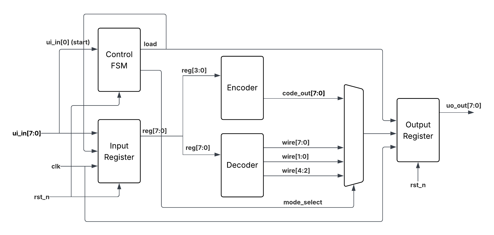

# Design Specification and Function Description
#### Hamming Code Encoder/Decoder for Single-Bit Error Correction and Double-Bit Error Detection

## Description
The project aims to design a digital circuit block that implements the Hamming code. It will consist of an encoder that encodes 4-bit data inputs into 8-bit code-words, and a decoder that will receive 8-bit codewords to detect and correct single-bit errors. It will also be able to detect 2-bit errors.

This module is implemented as a FSM (finite-state machine). On each rising clock edge it progresses through the 5 states as follows:

1. **IDLE**
 - wait for the **start** signal (`ui_in[0] = 1`).  

2. **IN1**
 - sample **mode_select** (`ui_in[0]`) to choose either `encode (0)` or `decode (1)` mode

3. **IN2**  
  - Encode mode: capture 4-bit **data_in** from `ui_in[3:0]`.  
  - Decode mode: capture 8-bit **code_in** from `ui_in[7:0]`.  

4. **OUT1**
  - drive 8-bit **code_out** (encoded or corrected) to `uo_out[7:0]`.  
5. **OUT2**: 
  - Encode mode: continue outputing encoded codeword
  - Decode mode: drive 5-bit status (error_location, error_flag) to `uo_out[4:0]`.

After OUT2, the FSM returns to IDLE.

## Input/Output
| Direction               | State | Mode | Pin          | Width | Description                                           |
|-------------------------|:-----:|:----:|:------------:|:-----:|:------------------------------------------------------|
| **Input** ui_in[7:0]    | IDLE  |  –   | ui_in[0]     | 1     | start                                                 |
|                         | IN1   |  –   | ui_in[0]     | 1     | mode_select: 0 = encode, 1 = decode                   |
|                         | IN2   |  0   | ui_in[3:0]   | 4     | data_in: 4-bit dataword                               |
|                         |       |  1   | ui_in[7:0]   | 8     | code_in: 8-bit codeword                               |
| **Output** uo_out[7:0]  | OUT1  |  0   | uo_out[7:0]  | 8     | code_out: 8-bit codeword                              |
|                         |       |  1   | uo_out[7:0]  | 8     | code_out: corrected codeword                          |
|                         | OUT2  |  0   | uo_out[7:0]  | 8     | code_out                                              |
|                         |       |  1   | uo_out[1:0]  | 2     | error_flags: 00 = error free, 01 = 1-bit error, 10 = 2-bit error |
|                         |       |      | uo_out[4:2]  | 3     | error_location (of 1-bit error)                       |

### Input/Output Format

~~~
D - dataword
C - checkbit
L - error_location
F - error_flag
~~~
**Encoder:** 
- Input { -, -, -, -, D3, D2, D1, D0, }
- output { Call, D3, D2, D1, C2, D0, C1, C0 }

**Decoder**
- Input { Call, D3, D2, D1, C2, D0, C1, C0 }
- output1 { Call, D3, D2, D1, C2, D0, C1, C0 }  (corrected)
- output2 { -, -, -, L2, L1, L0, F1, F0 }

| Error_flag |  Description                                       |
|------------|----------------------------------------------------|
| `00`       | No error; position – don’t care                    |
| `01`       | 1 error – **error_position** will be 0 ≤ x < 8       |
| `10`       | 2-bit error detected; error position – don’t care  |
| `11`       | N/A – will not happen                              |

### PARITY / SYNDROME CALCULATION
**Parity Bits**:   
  - C0 = D0 ⊕ D1 ⊕ D3  
  - C1 = D0 ⊕ D2 ⊕ D3  
  - C2 = D1 ⊕ D2 ⊕ D3  
  - Call = D0 ⊕ D1 ⊕ D2 ⊕ D3 ⊕ C0 ⊕ C1 ⊕ C2  

**Syndrome**:  
  - decoder recompute the parity bits (ie. R0-R2, Rall)  
  - The 3-bit syndrome is computed by comparing the inputted parity bits and the newly computed ones: 
    - S = [C2⊕R2, C1⊕R1, C0⊕R0]

## Block Diagram

## Timing Diagram

## Test Plan
#### Test 1 - Check encoding logic
  - define a lookup table containing data inputs with the corresponding outputs expected
  - loop through known 4-bit inputs, verify output matches expected 8-bit
#### Test 2 - Decode known 8-bit inputs
  - Verify output matches expected 4-bit
  - Define lookup table containing inputs with corresponding outputs
#### Test 3 - Introduce single-bit errors in 8-bit codeword
  - Verify error has been detected
  - Verify error bit location is correct
  - Verify that the final result has been corrected
#### Test 4 - double error detection
  - Introduce double-bit errors in 8-bit, decode, and verify errors have been detected

## Logs
- ... (previous activities to be added)

- June 27: transferred initial documentation/resources from google doc

- ...
- July 8: debugged decoder & wrote test cases outlined in test plan
- July 13: revised block diagram
- July 21: completed all test cases, updated documentations

### TODO: next steps 
    1. Complete documentations
        - check repo & google doc history and log activities/timelines
        - fix timing diagram

    2. Test cases
        - complete testing in all cases

    3. (optional) run performance evaluation/testing

    4. (optional) inferred latch problem